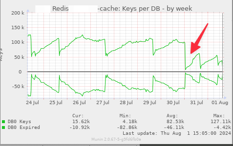
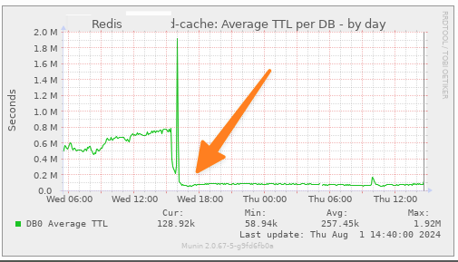

# Vendic_OptimizeCacheSize
Magento 2 extension that reduces the number of cache keys by removing `catalog_product_view_id_`, `catalog_product_view_sku_`, `catalog_category_view_id_`
layout handles **by default**, 

**This means that you loose the option to have product/category specific layout handles** (both through the use of XML files in your installation _and_ through the use of Design > Layout and Design > Custom Layout Update on the category and product edit pages in the admin), unless you re-enable them via the configuration.

Configuration: Stores -> Configuration -> Vendic -> Optimize Cache Size

## Installation
```bash
composer require vendic/module-optimize-cache-size
```

## Related discussions
- [#189 Configuration option to disable product specific layout update handles  ](https://github.com/magento/magento2/issues/189#issuecomment-698430804)
- [#102 New handles for the Category, Product and CMS pages](https://github.com/magento/magento2/issues/102)
- [#36244 Product layout based on attribute set](https://github.com/magento/magento2/pull/36244#issuecomment-2231106962) - We need to adjust this extension for Magento 2.4.8, since it's not possible to create specific layouts per attribute set. See [toonvd's comment](https://github.com/magento/magento2/pull/36244#issuecomment-2265233727) 

## Results
Here's a some real life results from a Magento 2.4 instance with 7k products and 1.5k categories:





The arrow marks the release of this extension. You can clearly see the results. Cache keys were reduced 50% (or more). Average Redis TTL also dropped significantly.
